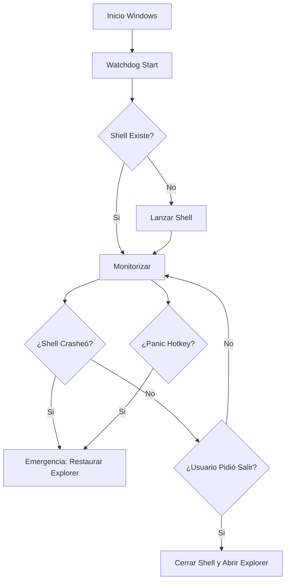

# Especificación Técnica: The Watchdog (Fail-safe System)

El componente más crítico del sistema. Su única misión es asegurar que el usuario nunca pierda el control de su PC.

## 1. Filosofía de Diseño
"Si algo sale mal, vuelve a Windows".

## 2. Implementación Técnica
El Watchdog será un proceso independiente (`watchdog.exe`), escrito en **Rust** (sin dependencias externas), que se inicia ANTES que el Shell principal.

### Ciclo de Vida
1.  **Boot:** Windows arranca -> Ejecuta `watchdog.exe`.
2.  **Monitor:** `watchdog.exe` lanza `shell_game.exe` como proceso hijo.
3.  **Vigilancia:** El Watchdog espera (wait) a que el proceso hijo termine.
4.  **Reacción:**
    *   Si `shell_game.exe` termina con **Código 0** (Salida limpia): El Watchdog asume que el usuario quiere salir y ejecuta `explorer.exe`.
    *   Si `shell_game.exe` termina con **Código != 0** (Crash): El Watchdog registra el error y lanza `explorer.exe` inmediatamente.
    *   Si `shell_game.exe` deja de responder (Hang): El usuario puede pulsar una combinación de teclas de emergencia.

### Combinación de Emergencia (Panic Chord)
El Watchdog registrará un "Global Hotkey" a bajo nivel (usando WinAPI `RegisterHotKey`).
*   **Combinación:** `Ctrl + Shift + Alt + Home` (o una combinación de botones en el mando: `L1 + R1 + Start + Select` mantenidos 3 segundos).
*   **Acción:**
    1.  Matar `shell_game.exe` forzosamente.
    2.  Restaurar resolución de pantalla segura.
    3.  Lanzar `explorer.exe`.

## 3. Diagrama de Flujo

## 4. Requisitos de Recursos
*   **CPU:** 0% (Debe estar dormido la mayor parte del tiempo).
*   **RAM:** < 2MB.
*   **Lenguaje:** Rust (por su nulo runtime) o C puro.
